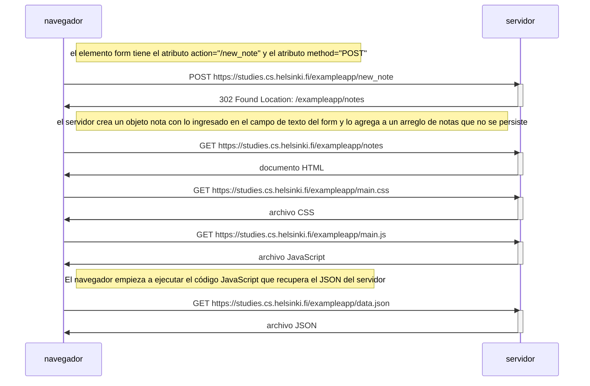

# ej0.4

```mermaid
sequenceDiagram
	participant navegador
    participant servidor

    Note right of navegador: el elemento form tiene el atributo action="/new_note" y el atributo method="POST"

    navegador->>servidor: POST https://studies.cs.helsinki.fi/exampleapp/new_note
    activate servidor
    servidor->>navegador: 302 Found Location: /exampleapp/notes
    deactivate servidor

    Note left of servidor: el servidor crea un objeto nota con lo ingresado en el campo de texto del form y lo agrega a un arreglo de notas que no se persiste

    navegador->>servidor: GET https://studies.cs.helsinki.fi/exampleapp/notes
    activate servidor
    servidor->>navegador: documento HTML
    deactivate servidor
 
    navegador->>servidor: GET https://studies.cs.helsinki.fi/exampleapp/main.css
    activate servidor
    servidor->>navegador: archivo CSS
    deactivate servidor

    navegador->>servidor: GET https://studies.cs.helsinki.fi/exampleapp/main.js
    activate servidor
    servidor->>navegador: archivo JavaScript
    deactivate servidor

    Note right of navegador: El navegador empieza a ejecutar el código JavaScript que recupera el JSON del servidor

    navegador->>servidor: GET https://studies.cs.helsinki.fi/exampleapp/data.json
    activate servidor
    servidor->>navegador: archivo JSON
    deactivate servidor
```