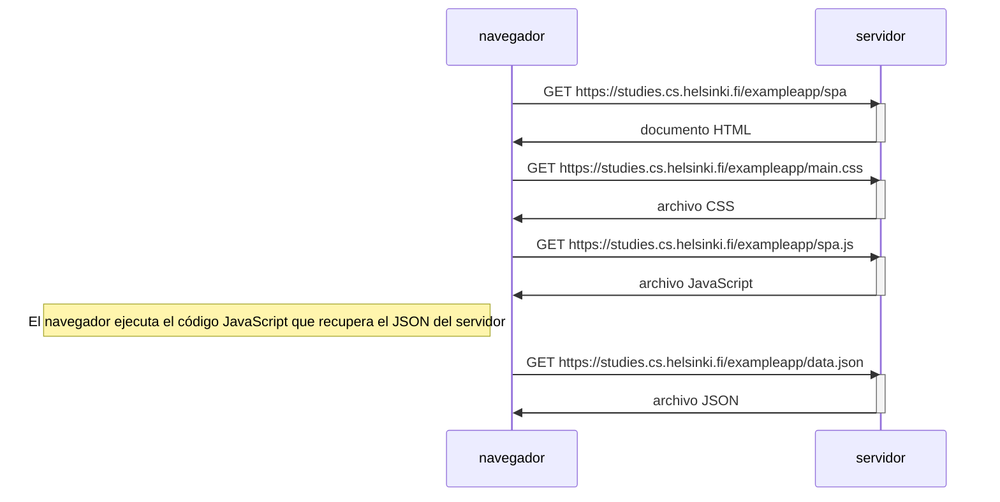

```mermaid
sequenceDiagram
	participant navegador
    participant servidor

    navegador->>servidor: GET https://studies.cs.helsinki.fi/exampleapp/spa
    activate servidor
    servidor->>navegador: documento HTML
    deactivate servidor
 
    navegador->>servidor: GET https://studies.cs.helsinki.fi/exampleapp/main.css
    activate servidor
    servidor->>navegador: archivo CSS
    deactivate servidor

    navegador->>servidor: GET https://studies.cs.helsinki.fi/exampleapp/spa.js
    activate servidor
    servidor->>navegador: archivo JavaScript
    deactivate servidor

    Note left of navegador: El navegador ejecuta el código JavaScript que recupera el JSON del servidor

    navegador->>servidor: GET https://studies.cs.helsinki.fi/exampleapp/data.json
    activate servidor
    servidor->>navegador: archivo JSON
    deactivate servidor
```