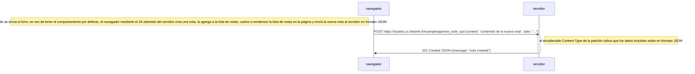

```mermaid
sequenceDiagram
	participant navegador
    participant servidor

    Note left of navegador: cuando se envía el form, en vez de tener el comportamiento por defecto, el navegador mediante el JS obtenido del servidor crea una nota, la agrega a la lista de notas, vuelve a renderizar la lista de notas en la página y envía la nueva nota al servidor en formato JSON
    navegador->>servidor: POST https://studies.cs.helsinki.fi/exampleapp/new_note_spa {content: "contenido de la nueva nota", date: "..."}
    activate servidor
    Note right of servidor: el encabezado Content-Type de la petición indica que los datos incluidos están en formato JSON
    servidor->>navegador: 201 Created JSON={message: "note created"}
    deactivate servidor
```